# Lil Bot: Team IV - A New Hope 
## 2018 UBC ENGINEERING PHYSICS ROBOT SUMMER - 3RD PLACE

# Table of Contents 
1. [Course Description](#course-description)
2. [Our Robot](#our-robot)
3. [Our Team](#our-team)
4. [Mechanical Design + Strategy](#mechanical-design--strategy)

	4.1. [First Design](#first-design)
	
	4.2. [Pivot in Strategy + Final Design](#pivot-in-strategy--final-design)
5. [Electrical Components](#electrical-components)
6. [Software](#software)
7. [Reflections](#reflections)

## Course Description
From [course website:](https://projectlab.engphys.ubc.ca/enph253_2018/)

ENPH 253 – Introduction to Instrument Design. Practical laboratory exposure to instrument bread-boarding including simple mechanical and electrical design, and communications with sensors, actuators. Micro-controller implementation and design.

Background on the course:

UBC Engineering Physics is an intense, five-year undergraduate engineering / physics / math combined major tailored for students who want to work at the new leading edge of science and engineering, whether in industry or academia. Part of this program is a series of project-based courses to educate students in the practice of engineering and applied physics. Introduction to Instrument Design is one of these courses, taken by our second-year (sophomore) students. Its goal is to train students in the practical aspects of intelligent instrument design and construction, including electrical and mechanical design, prototyping, microcontrollers, sensors, actuators, motion control, and control theory.

To offset the intensity and difficulty of the course, the engineering content to be tackled by the students has been framed in the context of an autonomous robot competition. Each year students spend six weeks in a series of labs and lectures to learn some basic elements of electromechanical design, and then form teams of four to embark on seven weeks of full-time robot design and construction. Time commitment during this phase is at the students’ discretion but often reaches 50 – 70 hrs/week. The course culminates in a publicly attended robot competition that also serves as the final exam. Past competitions have included one-on-one hockey, volleyball, and search and rescue challenges.

## The Challenge

[Detailed Rules](https://docs.google.com/document/d/18rYIVlMZeD559deR7-5YjfQzZz4BeeS6pr8FI5Qlm8Q/edit)

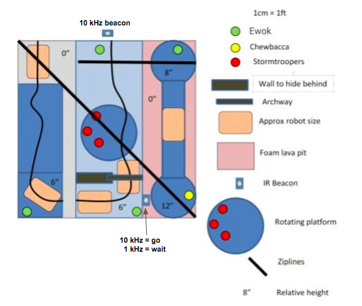

The theme of this year's competition is Star Wars, we have been tasked to build fully autonomous robots to rescue Ewoks and Chewbacca from the Empire's Stronghold. There are various difficult challenges on the way to Chewbacca, the robots have to, without human interaction, navigate the course, find and pick up Ewoks, cross gaps, detect and distinguish between different infrared frequencies and most importantly, return the rescued Ewoks and Chewbacca back to the startingg location. Picking up an Ewok is worth 1 point and succesfully returning an Ewok earns the team 2 additional points. Picking up Chewbacca is worth 2 points, and returning Chewbacca earns the team 3 additional points. 

There are various objects to assist and guide the robots such as the black electrical tape found throughout most of the course, as well as metal pipes serving as ziplines for robots to return rescued Ewoks. However, mistakes are costly, if the robot fails to detect the correct infrared frequency, the alarms will be triggered and a platform at the center of the course will begin to rotate, which can disorient the robots and result in a failed rescue attempt.   

## Our robot

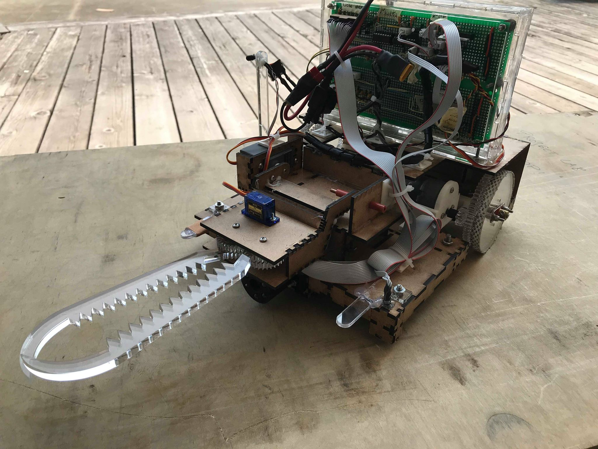

FUN FACT: Our robot had gone through various iterations, four to be exact. With us being Team 4, we therefore dubbed our final iteration "A New Hope", the fourth episode in the Star Wars series. 

The final design of our robot is based around consistency and simplicity. Many designs in the competition aimed to store picked up Ewoks in a basket and return the basket when it reaches the end of the course via the zipline. However, we felt this was too risky. If the robot is unable to reach the end of the course for whatever reason then it would not be able to return the already picked up Ewoks and would lose out on the majority of the points. 

Therefore, our design focused on picking up and returning each of the Ewoks individually to the starting area. Using encoders, we were able to precisely and accurately maneuver our robot and returned the Ewoks by placing them in the start area as well as dropping them over the ledge into the starting area. 

### Lil' Bot in Action

Lil' Bot in the Competition

Lil' Bot Test Run (9 points)

## Our team

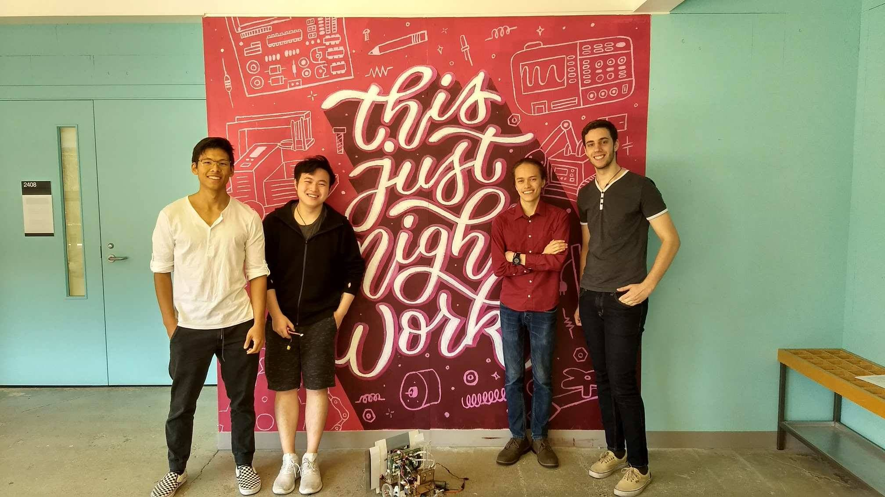

Frank Jia - Mechanical Design and Fabrication, Testing and Optimization

Charles Qian - Mechanical Design and Fabrication, Testing and Optimization

David Berard - Electrical Design and Fabrication, Software Development, Testing and Optimization

Alberto Misail - Electrical Design and Fabrication, Software Development, Testing and Optimization

## Mechanical Design + Strategy

### First Design 

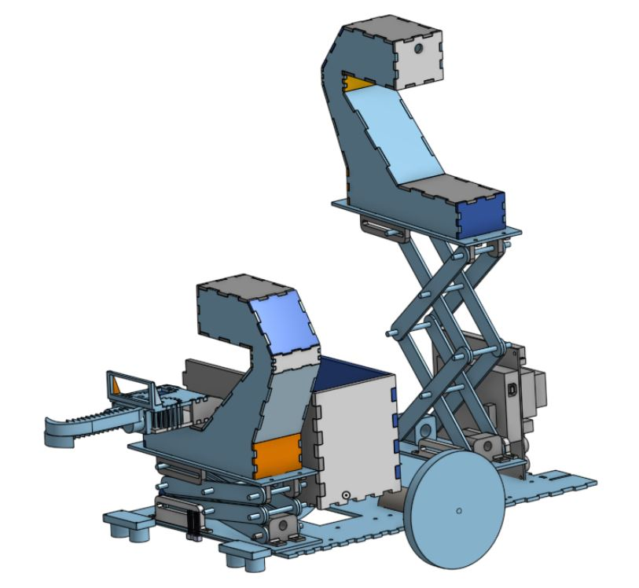

The first iteration of our design was composed of a dual scissor lift and pulley with a basket in the middle. The lift and pulley mechanism would allow us to go up and down the two ziplines on the course, allowing us to complete the competition in a non-linear fashion. 

This was the strategy that would allow us to retain flexibility and target ewoks selectively, which would give us a competitive advantage in certain situations. We worked on this first iteration extensively but discovered that the engineering challenge was too difficult in the given time-frame. This realization forced us to pivot to a simpler design that was much more reliable but less flexible. Nevertheless, we were able to design and build all modular components of this first design.

#### Lift System

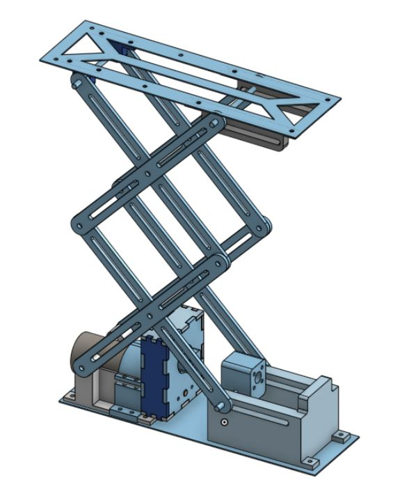

Our first design features a dual scissor lift, driven by a standard DC motor and geared down with a transmission. The transmission is coupled to a lead screw which would lift up and down the upper platform. Initial prototypes were constructed using laser-cut hardboard pieces and 3D printed mounts.

#### Pulley System
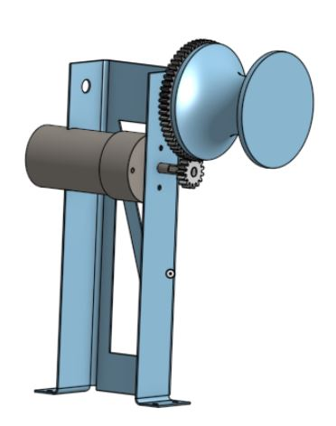

The pulley to allow our robot to go up and down the ziplines needed to be light (to keep the center of mass low to the ground), yet powerful enough to drive a 5kg+ load up an inclined zipline. Using these design restrictions, we opted for a relatively simple and lightweight structure, built using 0.8mm aluminum that was waterjet cut to fit specifications. We used a DC motor which was geared down for increased torque

### Pivot in Strategy + Final Design
As mentioned, our initial strategy was too time intensive to execute. In addition to fabricating all the designs, we found that we had very little time to iterate for reliability. In addition, the weight of a dual lift and pulley system put our robot at a speed disadvantage. To address these issues, we stripped our design of all parts that were non-critical to the competition flow. Our final chassis was extremely light, agile, and reliable, which gave us a significant advantage during the time-limited competition runs.

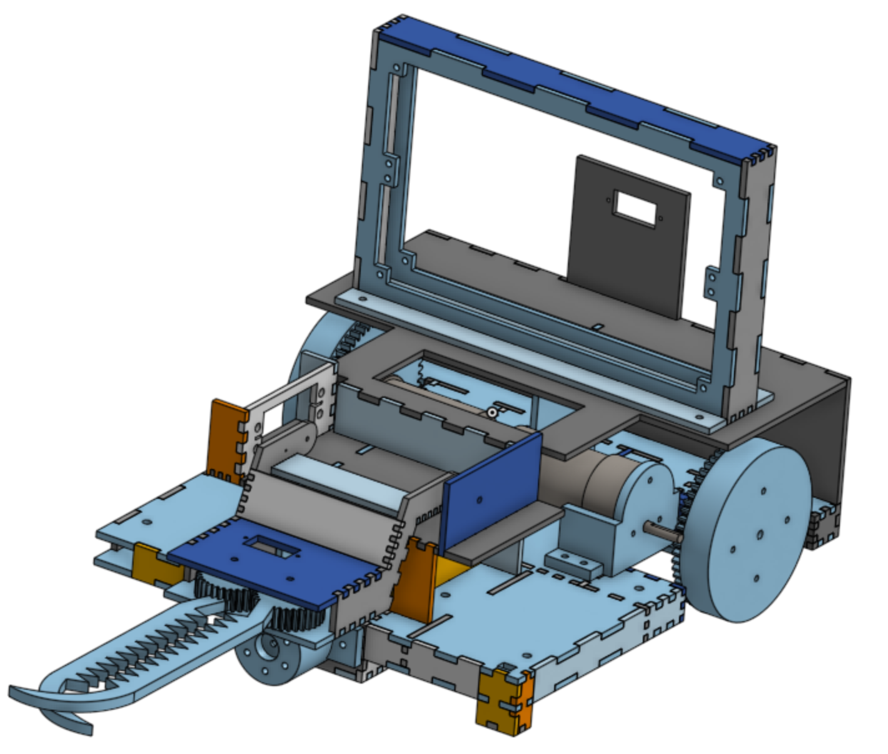

[Final Chassis CAD - OnShape](https://cad.onshape.com/documents/e5c3377a8716b8da60088099/w/010801819196a53872331fb3/e/1dbbbb5ea80693d58eb4c532 "Lil Bot CAD") 

Our final chassis was a dual-layered and had support for the following:
- A claw system for holding and picking up ewoks and chewbacca
- Two bridges (and a simple bridge dropping mechanism) for crossing the gaps
- A second level for circuit mounting and wire organization
- Support for motor, axle, and encoder mounts as well as required sensors

We stripped even the functionality of having a basket, opting to rescue each ewok individually. This gave us a significant decrease in size, which contributed to a large increase in agility and speed. We also opted for an open chassis design, which allowed us to troubleshoot much faster and helped us eliminate motor noise issues from a cramped inner compartment.

#### Basic Chassis Design

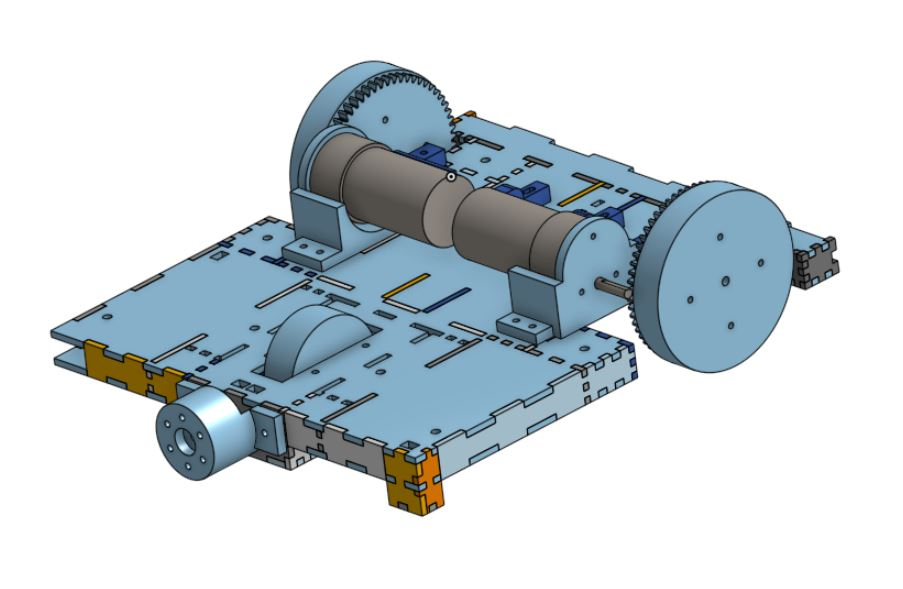

The basic chassis was large enough to hold the motors, wheels, axles, and one claw. The first layer of the chassis was constructed out of laser-cut hardboard, and was dual-layered to reduce any possible flex. The rigidity of the chassis allowed us to make quick adjustments in speed and direction. 

#### Claw System

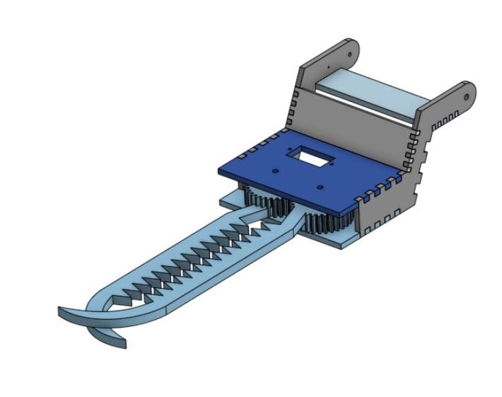

[Claw System CAD - Onshape] (https://cad.onshape.com/documents/ba80560c7ad54f163c77a1c2/w/127cfb8a319be0fdb18ce1d3/e/1f57a8d6266c7a1f6b8fe82e)

Given the relative inaccuracy of IR object sensing (Attributed mostly by the changing ambient light conditions) and the intention to hold ewoks for extended amounts of time (instead of dropping them into a basket), our claw needed to be forgiving and relatively strong. We opted for a "serrated" claw design with a hook-like structure at the end. The serrated design would help hold ewoks in place during travel, and the hook-like structure would help scoop any ewoks in if they were slightly too far. This entire mechanism was driven by a small servo, geared to increase grip torque. 

The entire claw assembly was attached to a rotating base, so that we could hold the claw up when it is gripping an ewok or when it is not in use.

#### Bridge Laying Mechanism

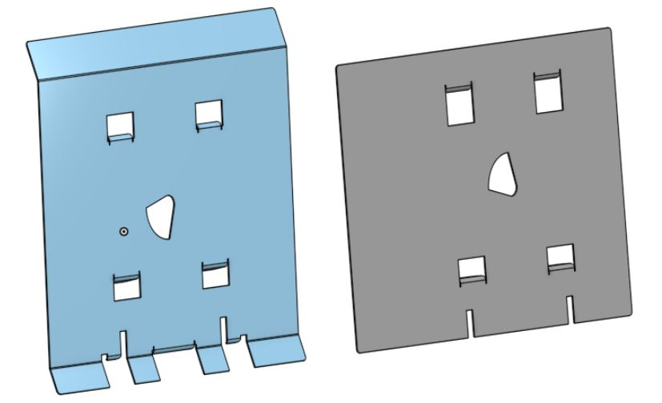

Simplicity and reliability allowed us to perform so well on competition day. Our bridge laying mechanism was a simple servo that would rotate to drop one bridge, but not the other. Iterating many times, we found the above bridge designs to fall into position the most reliably. The flanges within the bridges themselves acted as a guiding mechanism for the bridges to fall properly. 

## Electrical Components

### STM32 "Blue Pill" Board

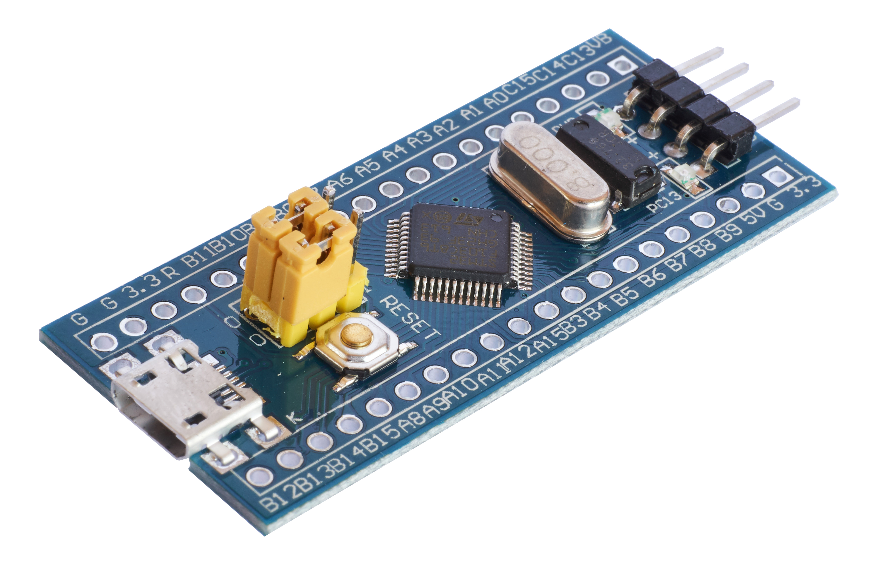

The STM32F106... board has a 72MHz processor, a fast analog digital converter, and three timers in a $2 tiny form factor. The small size and high speed were extremely useful, but the board had never been used in ENPH253 before; we learned a lot when developing a lot of software from scratch, learning along with the instructors.

### H-bridges

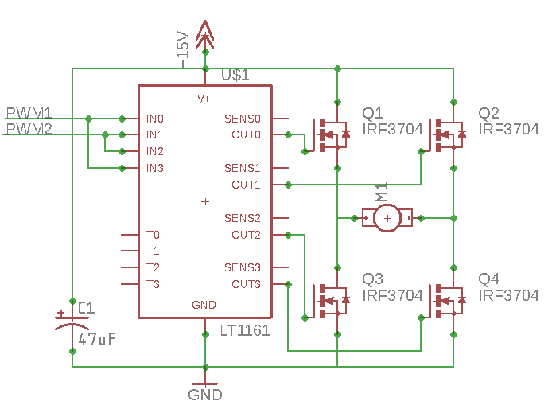

H-bridges are circuits that can amplify the small signals from our microcontroller and allow our motors to run both in forward and reverse at high power. The MOSFET transistors in this circuit act as switches, providing power in either forward or reverse through the motor. Teams historically have a difficult time building and testing this circuit, and our team was no exception; we learned a lot about noise, microcontroller timers, and cable management while debugging this circuit.

### Line Following with Infrared Sensors

A black line running across the competition surface acts as a guide for our robots to follow. In order to sense this line, we used a sensor called QRD1114. The QRD sensor is essentially a phototransistor with an Infrared LED. Most teams simply keep the LED on and take readings from the output of the phototransistor. The black surface reflects less light than the white surface, providing a sense of where we are. 

However, sensors like the QRD is very sensitive to ambient light, therefore most teams have to calibrate to different ambient conditions and their line following results can greatly differ in different conditions depending on the calibrated thresholds. In an attempt to solve this issue, we pulse infrared light from LEDs at the ground, and measure the amount of reflected light with the phototransistor. We then compared the values from when the LED is on and when the LED is off. This did improve the overall performance and accuracy of our sensors, allowing us to perform better in a wider range of ambient lighting at the cost of speed of data reading. 

### Ewok Sensor

Inspired by our line-following sensors, we mounted a high-powered equivalent at the front of our robot. Instead of using QRDs, we used 6 Infrared LEDs and a single phototransistor. We used CAD and 3D printed a container to mount this sensor to the front of our robot. In order to account for different ambient infrared amounts, we pulse the LEDs in order to get readings with only ambient light, and readings that include light reflected off the surroundings. Using this method, we were able to sense detect from over half a meter away! Often times people thought our Ewok Sensor was a camera because it was very quick and precise at detecting objects from from a distance. 

The following is a CAD model of our Ewok Sensor. The 6 infrared LEDs form a ring around the phototransistor in the center and is mounted to the front of the chassis with fasteners. 

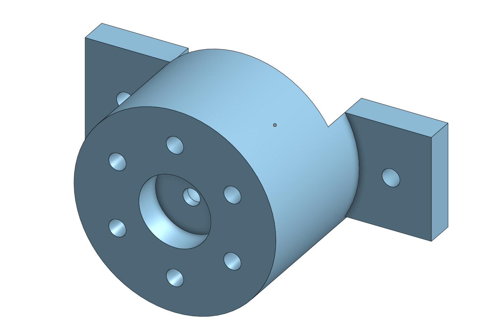

### Encoders

To provide more control over our robot, we added rotary encoders on our wheels. These sensors allow us to know how many rotations our wheels have had. This allows our robot to make precise movements which will always work as expected. A simpler time-based control is much more dependent on battery voltage or small changes in mass distribution.

### Form Factor

In our first design, we did not reserve any space for our circuitry, leading to makeshift mounting solutions and extremely messy wiring. Learning from our mistakes, we designed an enclosure which isolated our circuits to one location, and relied on high-quality JST connectors for any sensor input. This solution allowed for easy replacement of electronic components, easy access to circuitry, and one of the most compact electronics systems in this year's competition.

The following is an early design sketch of our circuit board design.
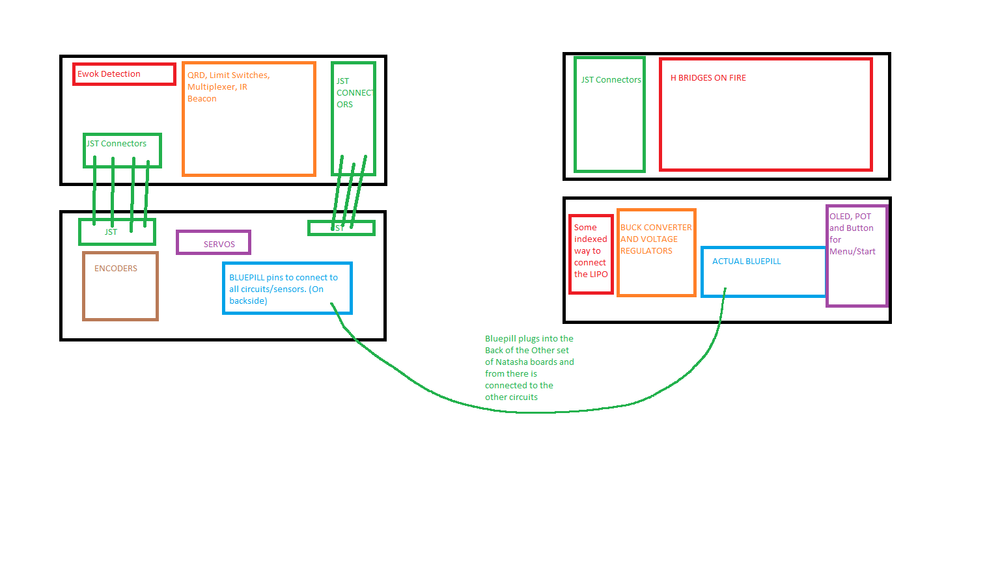 

### Loose Wires

In a final product design, the loose wires found on our robot would be unacceptable; free wires can become detached at connection points when they move. However, hidden, completely secured wires are difficult to replace or move. We found a balance on our final design; we used good connectors, and we made sure to zip-tie our wires in place once we finalized our circuitry. The free wires saved us hours when we fine-tuned and replaced our sensors.

## Software

### Frequency Sensing: 1kHz vs 10kHz

One of the obstacles of the course implied detecting the difference between a 1kHz and a 10kHz signal, emmited by an infrared beacon. Most teams used a band-pass filter circuit that only allows signals with frequency in a particular range to go through. With two of these circuits, one for 1kHz and the other one for 10kHz, one can compare the intensity of both signals and determine which one is the predominant. Although we built this circuit, we found potential problems with it. For example the resistor have to be adjusted so the amplification in the op-amps is enough to detect the difference on intensity. Furthermore, if not taken the appropiate care the op-amps might saturate disturbing the readings. We decided to se a much simpler circuit and determine the frequency using software. This solution allowed us to fine-tune and debug our frequency sensor much faster.

We got readings from the signals with an infrared detector. The obtained signal was convoluted against reference signals of 1kHz and 10kHz. The two possible values for the emmited signal, sinusoidal at either 1kHz or 10kHz, are orthogonal to each other. Therefore, when convoluting the emmited signal with the two reference signals, the convolution that resulted in the higher value would be the frequency of the emmited frequency. The phase of the emmited frequency was not known, therefore the convolution was made on both the sine and the cosine of the sinusoidals.

### Proportional Integral Derivative Control

Most of the movements, were controlled with the PID technique, Proportional Integral Derivative. PID is a control loop that continuously calculates an error value as the difference between a desired setpoint and a measured process variable and applies a correction based on proportional, integral, and derivative terms.

As far as line following is concerned, our desired point were the two QRDs being in the black tape. There were five possible states as shown in the table below, but the readings from the QRDs only gave us for different states, they cannot differentiate when both QRDs are white to which side of the tape the robot is. For this reason we had to always cache the previous state in order to determine the difference between the two states where both QRDs are on white. This is the table of possible states that we used:

|State  |Error   |
|---|---|
|Both in black   |  0 |
| Left in black, right in white  | 1 |
| Both in white but left was in black last  | 5  |
|  Right in balck, left in white | -1  |
|  Both in white but right was in black last | -5  |

For the fine maneuvering of our robot we used encoders. When doing turns, we realized that if we moved each wheel independently and counted the corresponding encoder steps, the movements were very inaccurate. To solve this, we implemented PID on our encoders. The error in this case was the difference between the desired ratio of movement of the wheel and the actual ratio of movement. For example, if we wanted the left wheel to move by 6 steps and the left one to move 3 steps, desired ratio 2. If the left wheel had move 3 steps and the right one 1, actual ratio 3, we would reduce the speed of the left wheel and increase the one of the right one.

### Multi-threading

At some points our robot had to do multiple actions at the same time, such as turning the wheels and flashing leds in order to look for ewoks. In order to simulate a multi-threaded processor we used a polling technique. Polling is the continuous checking of other programs or devices by one progam or device to see what state they are in, usually to see whether they are still connected or want to communicate. We modelled the different physical components, such as the encoders, with cygwin. With this unit testing framework, we were able to test our code and make sure there were no bugs before flashing our microprocessors.

### Unit testing framework

In order to be able to test our code, we wanted to write unit tests. 

## Reflections

### Areas to Improve in Design

One of the most important lessons we learned throughtout this course is that a simple and consistent design is key to a great engineering project. Initially, our design was much more complex and therefore had more points of failure. By reducing the 

If we were to do this again, we can definitely improve on our documentation. Though we attempted to use Trello to keep track of our development and progress, things got very messy on our Trello board quickly. It is very important for a well functioning team to have an organized structure to document the development process.

A major mistake that slowed down our progress was that we were too slow to adapt to changes in the rules. Our original plan hinged on the fact that rescuing Chewbacca is worth rescuing 3 Ewoks. When the points for Chewbacca was lowered, we did not adapt to this change quickly. This large portion of our time could have been used to further improve our final design. 

This project allowed us to go through the entire development engineering development phase, from brainstorming, to designing, to fabricating and testing. We learned a lot about iteration

Considering software improvements, we believe that our biggest error was to assume that writing firmware was almost the same as writing high-level software. We found out that in firmware, if you do not have a unit testing framework is very hard to find bugs and correct them. In the future, we will make the physical design of our robot less software dependant. Althoug some software solutions really helped us have a very good control of our robot, we realize that some of our software could be simplified with a better physical design.

 
